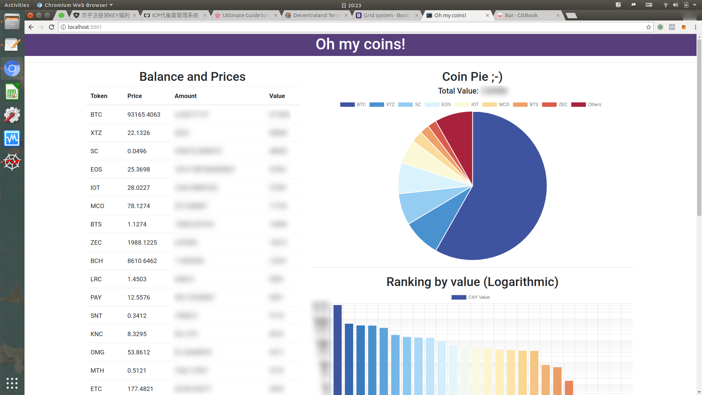

# ohmycoins
See how many coins you have and how much they value with data from many sources.

如果你有很多钱包，在很多交易所有账户，那么很难一下子说清楚自己到底有哪些币，每样有多少，也不知道加起来值多少钱了。这个项目就是帮你做这件事，设置好自己的钱包地址以及交易所API，然后一键查询自己的虚拟货币资产状况。目前支持的数据来源有：
- Etherscan（直接提供地址查询）所有ETH和基于以太坊的代币
- Bittrex（币种和余额查询）
- Poloniex（币种和余额查询）
- Bitfinex（币种和余额查询）
- CoinmarketCap（查询价格）

## 简介
### 原理
根据提供的地址去etherscan查询余额，通过API查询交易所账户的余额，最后到Coinmarketcap查询所有币种当前CNY价格，最后用chartjs生成图表，用flask展示网页。
### 使用
首先安装依赖：
```
pip3 install flask beautifulsoup4 cfscrape
```
然后在config.py中设置好各项参数，包括需要查询的eth地址、交易所api key和secret等，设置好后运行（这一步建议配合proxychains从梯子走，因为有些交易所要被墙了）：
```
python3 app.py
```
然后浏览器打开 localhost:5001 需要等大概半分钟，数据抓好后即显示图表
### 效果图

## TODO
- 需要一个好看的前端！！（对，我的意思好像是需要一个长得好看的前端妹子）
- 前端交互：先显示页面，然后再爬取数据，完成后展示
- 添加更多数据来源，完善逻辑和容错处理
- （也许）写成Web服务或微信公众号服务
