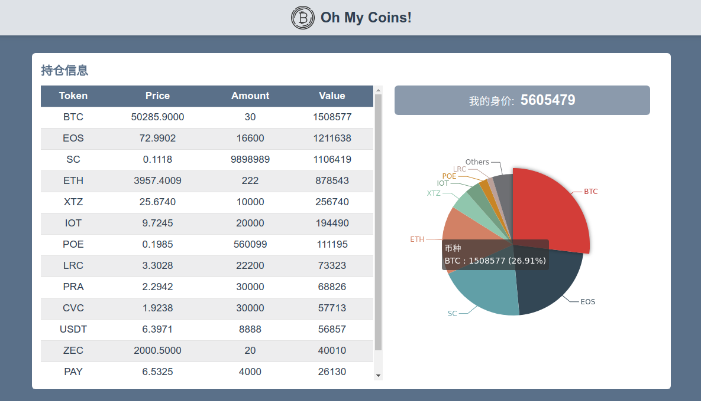

# ohmycoins
See how many coins you have and how much they value with data from many sources.

如果你有很多钱包，在很多交易所有账户，那么很难一下子说清楚自己到底有哪些币，每样有多少，也不知道加起来值多少钱了。这个项目就是帮你做这件事，设置好自己的钱包地址以及交易所API，然后一键查询自己的虚拟货币资产状况。目前支持的数据来源有：
- Etherscan（直接提供地址查询）所有ETH和基于以太坊的代币
- 各交易所账户（币种和余额查询）：Poloniex, Bittrex, Bitfinex, Bigone
- CoinmarketCap（查询价格）

## 简介
### 原理
本程序前后端分离，前端由[seven同学](https://github.com/seven777777)开发
- 资产统计：根据提供的地址去etherscan查询余额，通过API查询交易所账户的余额，最后到Coinmarketcap查询所有币种当前CNY价格，最后前端生成图表，展示网页；
- 词云：爬取金色财金最近几千条新闻的标题与摘要，分词后生成词云（后端尚未完成）。

### 用法
首先安装依赖，后端通过pip3，前端通过npm，然后分别运行：

#### 后端
`pip3 install -r requirements.txt`
`python3 app.py`

#### 前端
`npm install`
`npm run dev`

试一下：可以在”自定义数据“文本框输入一下虚构的资产余额查看效果：
> {"BTC": 30, "XTZ": 10000, "PRA": 30000, "ETH": 222, "EOS": 16600, "MANA": 23212, "SC": 9898989, "USDT": 8888, "LRC": 22200, "POE": 560099, "CVC": 30000, "ZEC": 20, "IOT": 20000, "PAY": 4000}

### 效果图

